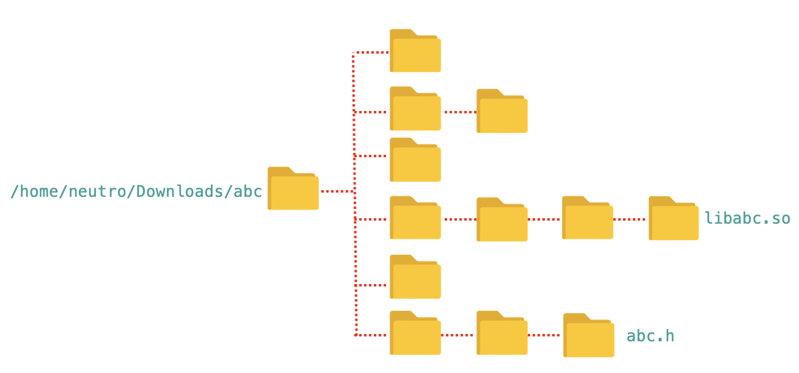

# Linking Libraries Using Specified Path 

Let's assume we have C++ with a description below.

| Name                              |  Value        |
| :--                               |  :--          |
| Project                           | MyProject     |
| Executable                        | MyApp          |
| Dependency (External Library)     | **abc**       |
| Header                            | /home/neutro/Downloads/**abc/include/abc.h** |
| Library                            | /home/neutro/Downloads/**abc/lib/libabc.so**

The simplest way to link the **abc** library to our app is using the full path during linking.

```bash
add_executable(MyApp main.cpp)

# include header
target_include_directories(MyApp PRIVATE /home/neutro/Downloads/abc/include)

# link library
target_link_libraries(MyApp PRIVATE /home/neutro/Downloads/abc/lib/libabc.so)
```

Let's assume we have 3 libraries
| Headers                                        |  Libarary        |
| :--                                            |  :--             |
| /home/neutro/Downloads/**abc/include/abc1.h**  | /home/neutro/Downloads/**abc/lib/libabc1.so** |
| /home/neutro/Downloads/**abc/include/abc2.h**  | /home/neutro/Downloads/**abc/lib/libabc2.so** |
| /home/neutro/Downloads/**abc/include/abc3.h**  | /home/neutro/Downloads/**abc/lib/libabc3.so** |

To link the libraries, we can use the same way as previously we do.
```bash
add_executable(MyApp main.cpp)

# include header
target_include_directories(MyApp PRIVATE /home/neutro/Downloads/abc/include)

# link library
target_link_libraries(MyApp 
    PRIVATE /home/neutro/Downloads/abc/lib/libabc1.so
            /home/neutro/Downloads/abc/lib/libabc2.so
            /home/neutro/Downloads/abc/lib/libabc3.so
    )
```

Another option we use <code>target_link_directories</code>. The format is
``` bash
target_link_directories(<target> <scope> <dir1> <dir2> <dir3>)
```

So, the instead of write full path for each libraries we can do the following option.

```bash
add_executable(MyApp main.cpp)

# include header
target_include_directories(MyApp PRIVATE /home/neutro/Downloads/abc/include)

# link directory
target_link_directories(MyApp 
    PRIVATE /home/neutro/Downloads/abc/lib/)

# link library
target_link_libraries(MyApp 
    PRIVATE libabc1.so
            libabc2.so
            libabc3.so
    )
```


# Linking Libraries Using find_path and find_library Command

Let's assume we have deep directory structure of **abc** library as the following picture.



## find_library
| Name         |  Value        | Note|
| :--          |  :--          |:--- |
| Library      | **libabc.so**|  |
| Location      | /home/neutro/Downloads/**abc/lib**|  |
| Format      | find_library(\<VAR> \<lib-name> \<path1> \<path2>)|  |
| Example Usage      | find_library(_abc_LIBRARY_ abc **HINTS** /home/neutro/Downloads/abc/lib)| abc_LIBRARY will be filled by /home/neutro/Downloads/abc/lib/**libabc.so**  |

If the library in one of more than one location. The <code>find_library</code> by default will not search in sub directory.

| Name         |  Value        | Note|
| :--          |  :--          |:--- |
| Library      | **libabc.so**|  |
| Location      | /home/neutro/Downloads/abc/lib <br/> /home/neutro/Downloads/abc/lib/abc-1.7|  |
| Format      | find_library(\<VAR> \<lib-name> \<path1> \<path2>)|  |
| Example Usage      | find_library(_abc_LIBRARY_ abc <br/>**HINTS** <br/>_/home/neutro/Downloads/abc/lib_ <br/>_/home/neutro/Downloads/abc/lib/abc-1.7_)| abc_LIBRARY will be filled by full path of **libabc.so** which is found  |


Instead of list each potential directory location, we can use more better way
| Name         |  Value        | Note|
| :--          |  :--          |:--- |
| Library      | **libabc.so**|  |
| Location      | /home/neutro/Downloads/abc/lib <br/> /home/neutro/Downloads/abc/lib/abc-1.7 <br/> /home/neutro/Downloads/abc/lib/abc-1.7/extra <br/>/opt/abc <br/>/opt/abc/lib <br/>/opt/abc/lib/extra| |
| Format      | find_library(\<VAR> \<lib-name> \<path1> \<path2>...<suffix1> <suffix2>)|  |
| Example Usage      | find_library(_abc_LIBRARY_ abc <br/>**HINTS** _/home/neutro/Downloads/abc/lib_  _/opt/abc_/<br/>**PATH_SUFFIXES** _abc-1.7_ _abc-1.7/extra_ _lib_ _lib/extra_)| abc_LIBRARY will be filled by full path of **libabc.so** which is found  |


If we are not sure the library name is <code>libabc.so</code> or <code>libabc-1.7.so</code> or <code>libabc-1.7.7.so</code> we can add a <code>NAME</code> option.

| Name         |  Value        | Note|
| :--          |  :--          |:--- |
| Library      | **libabc.so**|  |
| Location      | /home/neutro/Downloads/abc/lib <br/> /home/neutro/Downloads/abc/lib/abc-1.7 <br/> /home/neutro/Downloads/abc/lib/abc-1.7/extra <br/>/opt/abc <br/>/opt/abc/lib <br/>/opt/abc/lib/extra| |
| Format      | find_library(\<VAR> \<lib-name> \<path1> \<path2>...<suffix1> <suffix2>)|  |
| Example Usage      | find_library(_abc_LIBRARY_ <br/> **NAMES** abc abc-1.7 abc-1.7.7 <br/>**HINTS** _/home/neutro/Downloads/abc/lib_  _/opt/abc_/<br/>**PATH_SUFFIXES** _abc-1.7_ _abc-1.7/extra_ _lib_ _lib/extra_)| abc_LIBRARY will be filled by full path of **libabc.so** which is found  |

## find_path
<code>find_path</code> has similar parameter as <code>find_library</code>.

| Name         |  Value        | Note|
| :--          |  :--          |:--- |
| Library      | **libabc.so**|  |
| Location      | /home/neutro/Downloads/abc/include <br/> /home/neutro/Downloads/abc/include/abc-1.7 <br/> /home/neutro/Downloads/abc/include/abc-1.7/extra <br/>/opt/abc <br/>/opt/abc/include <br/>/opt/abc/include/extra| |
| Format      | find_path(\<VAR> \<file-name> \<path1> \<path2>...<suffix1> <suffix2>)|  |
| Example Usage      | find_path(_abc_INCLUDE_ abc.H <br/>**HINTS** _/home/neutro/Downloads/abc/include_  _/opt/abc_/<br/>**PATH_SUFFIXES** _abc-1.7_ _abc-1.7/extra_ _include_ _include/extra_)| abc_LIBRARY will be filled by full path of **libabc.so** which is found  |


## Differences find_library vs find_path
Beside searching on specified location, the <code>find_library</code> and <code>find_path</code> also have default search locations. 


| Difference                              |  find_library        | find_path|
| :--                |  :--          | :--          | 
| Default Location   | - <code>/usr/include</code> <br/> - <code>/usr/include/x86_64-linux-gnu</code> |- <code>/usr/lib</code> <br/> - <code>/usr/lib/x86_64-linux-gnu</code>  |
| Output   | full path library file | full directory path |


# Writing Own Find Module
Assuming there is no file *.pc of GTK3

1. Create FindGTK3 module on <code>cmake/modules/FindGTK3.cmake</code>
2. Tambahkan <code>find_library</code> terhadap **lib GTK3** (search dari terminal )
3. Tambahkan <code>find_path</code> terhadap **header GTK3** (search dari terminal )
4. Tambahkan juga <code>find_library</code> dan <code>find_path</code> pada dependensinya yang muncul saat build.


# TIPS
To make verbose build:
1. From CMake
    ``` bash
    # Build your project with verbose output
    # This will allow you to see the exact commands being used.
    # And this works with Makefiles, Ninja, Visual Studio, etc.
    
    $ cmake --build build --verbose
    ```
    
    ``` bash
    # to make permanent
    $ cmake -DCMAKE_VERBOSE_MAKEFILE:BOOL=ON .
    $ make
    ```

2. From make
    ``` bash
    $ cmake
    $ make VERBOSE=1
    ```

    Example output:
    ``` bash
    [ 50%] Building CXX object CMakeFiles/GTK_FindModule_app.dir/main.cpp.o
    /Library/Developer/CommandLineTools/usr/bin/c++  -I/usr/local/include/gtk-3.0 -I/usr/local/include/glib-2.0 -I/usr/local/Cellar/glib/2.68.2/lib/glib-2.0/include -I/usr/local/include/pango-1.0 -I/usr/local/include/harfbuzz -I/usr/local/include/cairo -I/usr/local/include/gdk-pixbuf-2.0 -I/usr/local/include/atk-1.0 -isysroot /Library/Developer/CommandLineTools/SDKs/MacOSX10.14.sdk -MD -MT CMakeFiles/GTK_FindModule_app.dir/main.cpp.o -MF CMakeFiles/GTK_FindModule_app.dir/main.cpp.o.d -o CMakeFiles/GTK_FindModule_app.dir/main.cpp.o -c /Users/neutro/workspace/work/personal/bitbucket2021/cpp-cmake/19_find_module/main.cpp

    [100%] Linking CXX executable GTK_FindModule_app
    /usr/local/Cellar/cmake/3.20.2/bin/cmake -E cmake_link_script CMakeFiles/GTK_FindModule_app.dir/link.txt --verbose=1
    /Library/Developer/CommandLineTools/usr/bin/c++  -isysroot /Library/Developer/CommandLineTools/SDKs/MacOSX10.14.sdk -Wl,-search_paths_first -Wl,-headerpad_max_install_names CMakeFiles/GTK_FindModule_app.dir/main.cpp.o -o GTK_FindModule_app  /usr/local/lib/libgtk-3.dylib /usr/local/lib/libgio-2.0.dylib /usr/local/lib/libgobject-2.0.dylib


    ```

