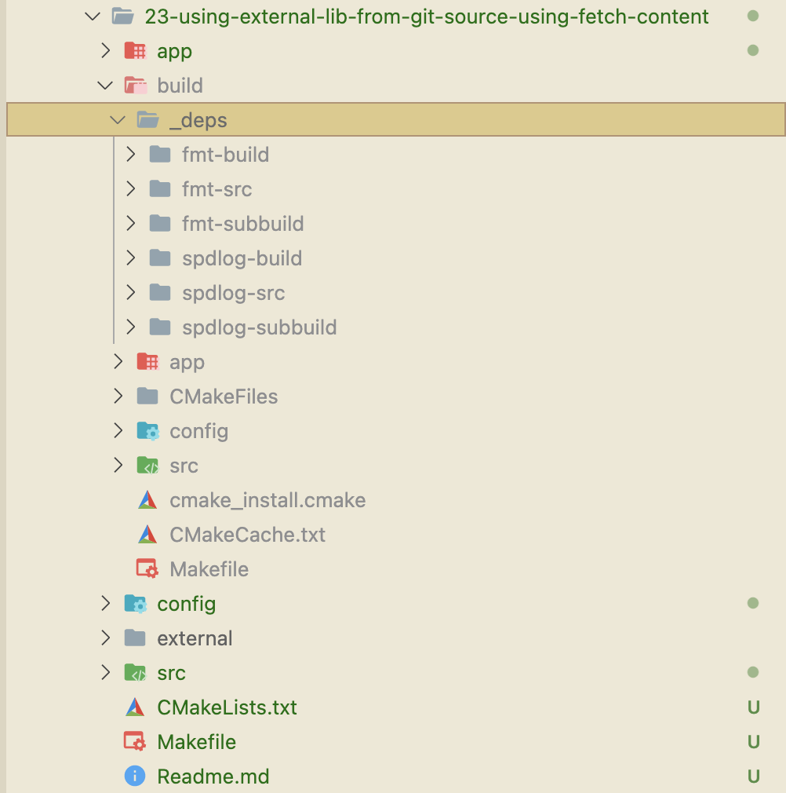
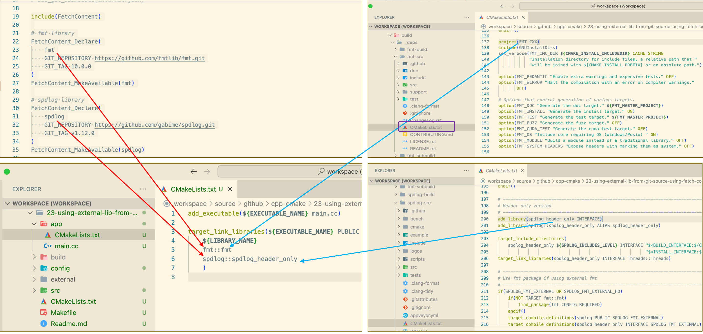

# Steps adding external library from git source (using fetch content)

1. Define the library we want to include. In this example we will use:
    - https://github.com/fmtlib/fmt
    - https://github.com/gabime/spdlog

2. At the root of CMakeLists.txt, add the following code
    ```bash
    
    ...
    include(FetchContent)

    # fmt library
    FetchContent_Declare(
        fmt
        GIT_REPOSITORY https://github.com/fmtlib/fmt.git
        GIT_TAG 10.0.0
    )
    FetchContent_MakeAvailable(fmt)

    # spdlog library
    FetchContent_Declare(
        spdlog
        GIT_REPOSITORY https://github.com/gabime/spdlog.git
        GIT_TAG v1.12.0
    )
    FetchContent_MakeAvailable(spdlog)

    ...

    ```
3. Run cmake command
    ```bash
    mkdir build
    cd build
    cmake ..
    ```

    The above command will download the source git repository to the directory <code>build/_deps</code>
    
    

4. On the executable CMakeLists.txt, add the following code to link the libraries to executable file.
    ```bash
    target_link_libraries(${EXECUTABLE_NAME} PUBLIC 
        ${LIBRARY_NAME}
        fmt::fmt
        spdlog::spdlog_header_only
    ) 
    
    ```
    

5. Consume the library in the executable code
6. Build and run the app
    ```bash
    cd build
    cmake ..
    make
    ./app/the_app
    ```